# Nama: Bagus aditya hermawan
# Nim: 312410382
# Kelas: I241C
# Matkul: Pemrograman Web 2

## Langkah-Langkah Praktikum
Mengaktifkan ekstensi yang diperlukan melalui XAMPP Control Panel. pilih bagian Apache lalu klik Config/PHP.ini.
##### 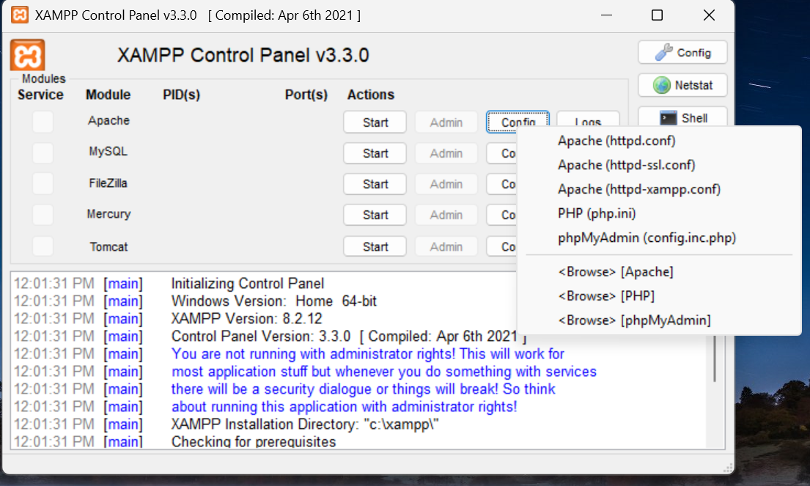.

Menghilangkan titik koma (;) pada ekstensi yang diaktifkan. lalu simpan kembali dan restart Apache web server.
##### 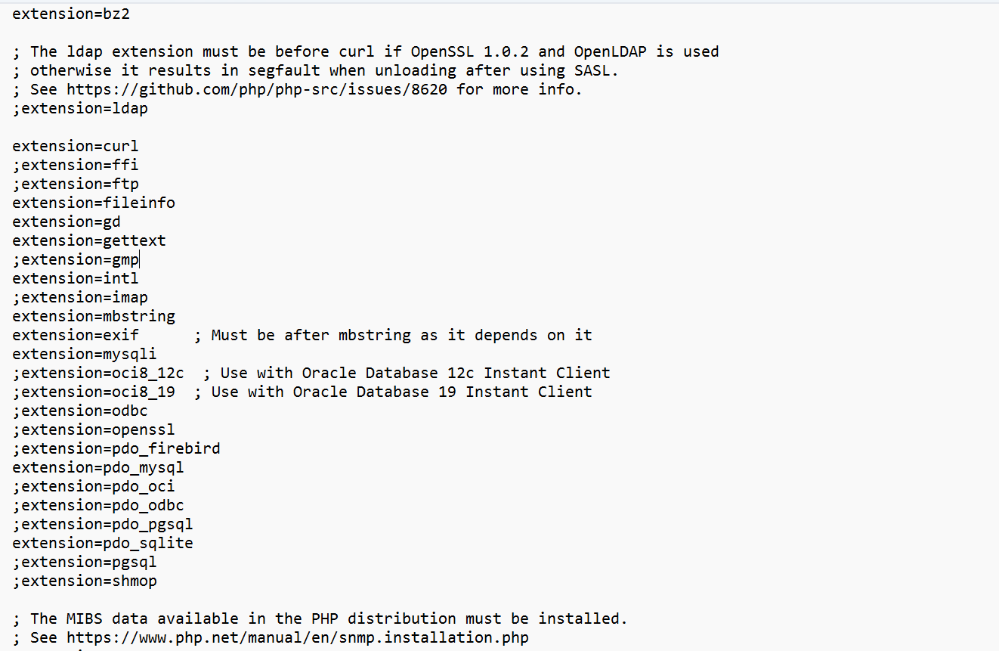.

Menginstall Codeigniter 4 dengan cara manual dan menggunakan Composer. setelah menginstall ubah ke extrak file zip Codeigniter ke direktori htdocs/lab11_ci. kemudian Ubah nama direktory framework-4.x.xx menjadi ci4. setelah langkah tadi dilakukan buka browser lalu ketik/salin http://localhost/lab11_ci/ci4/public/.
##### 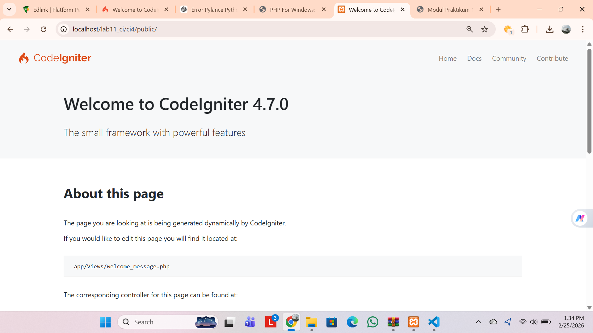.

Menjalankan CLI dengan memanggil php spark untuk mempermudah proses development. Caranya membuka terminal command prompt. lalu lokasi direktori diarahkan sesuai dengan direktori project yang dibuat.
##### 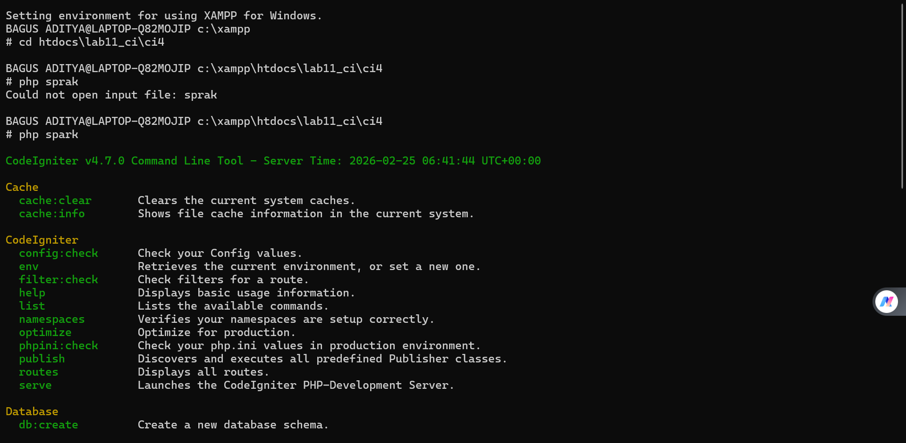.

Mengaktifkan mode debugging untuk memudahkan developer dalam mengetahui pesan error apabila terjadi kesalahan dalam kode program.
##### 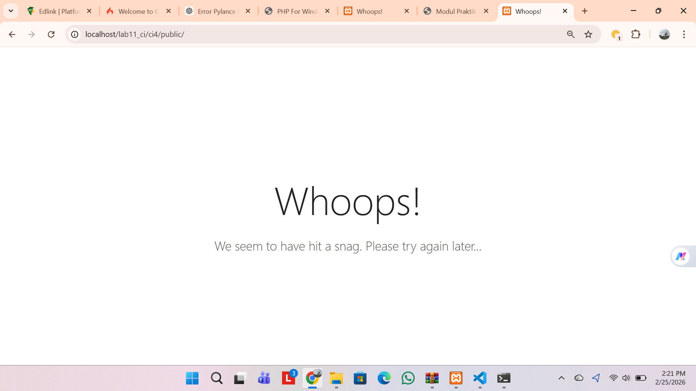.

Dengan cara mengubah nilai konfigurasi pada environment variable CI_ENVIRINMENT menjadi development.
##### 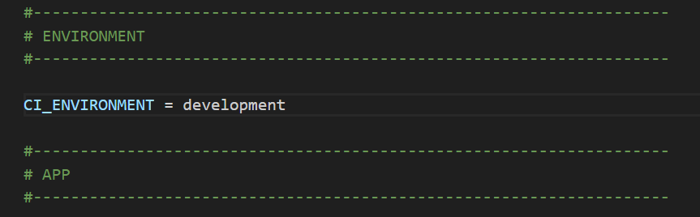.

Lalu ubah nama file env menjadi .env.
##### 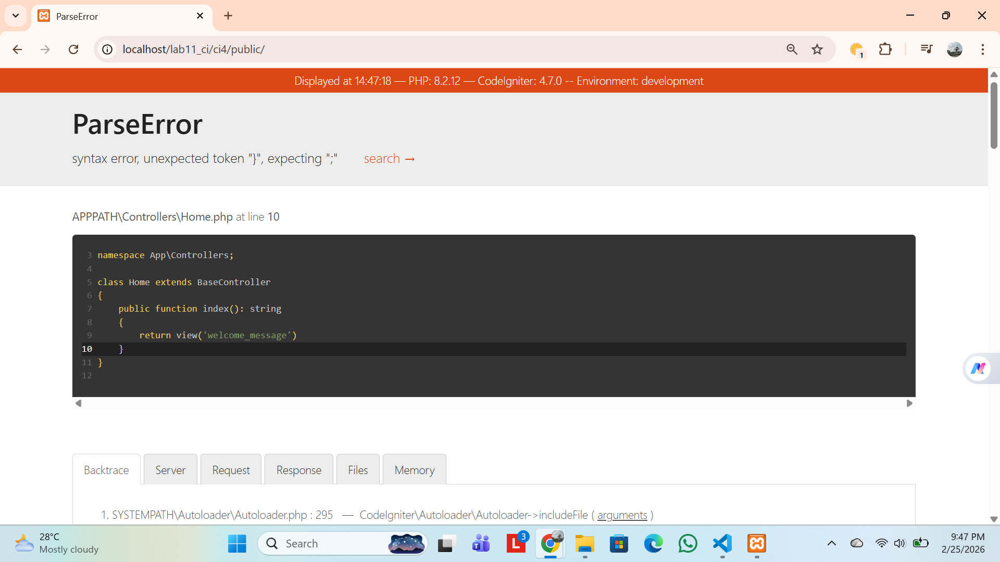.

Mencoba error dengan mengubah kode pada file app/Controller/Home.php dan hilangkan titik koma pada akhir kode.
##### .

Berikut adalah struktur direktorinya.
##### 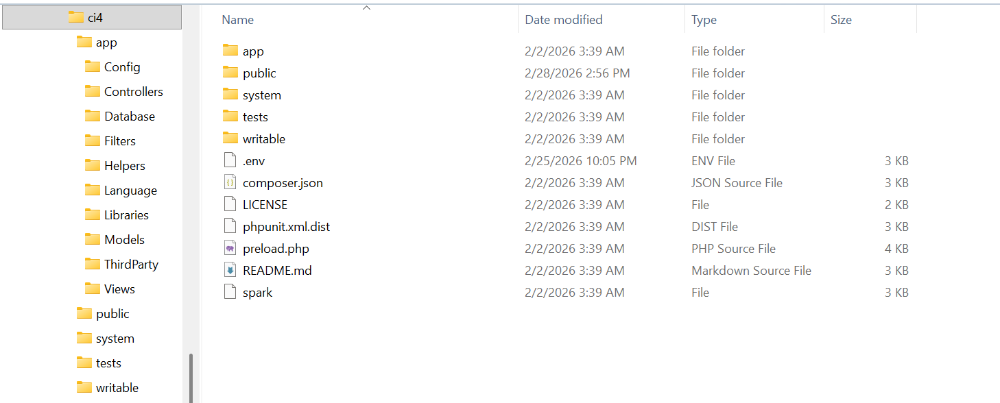.

Router terletak pada file app/config/Routes.php.
##### .

Mendefinisikan route untuk aplikasi. seperti:
```python
$routes->get('/', 'Home::index');
```
Membuat route baru di dalam Routes.php:
```python
$routes->get('/about', 'Page::about');
$routes->get('/contact', 'Page::contact');
$routes->get('/faqs', 'Page::faqs');
```

Kemudian mengecek route apakah sudah benar dengan menjalankan perintah "php spark routes".
##### 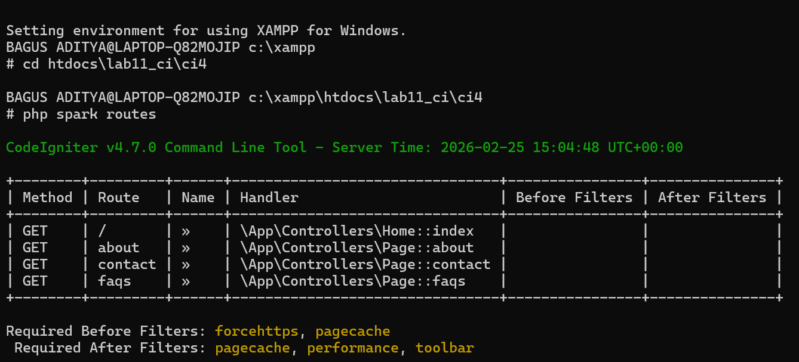.

Lalu akses alamat url yang telah dibuat tadi.
##### 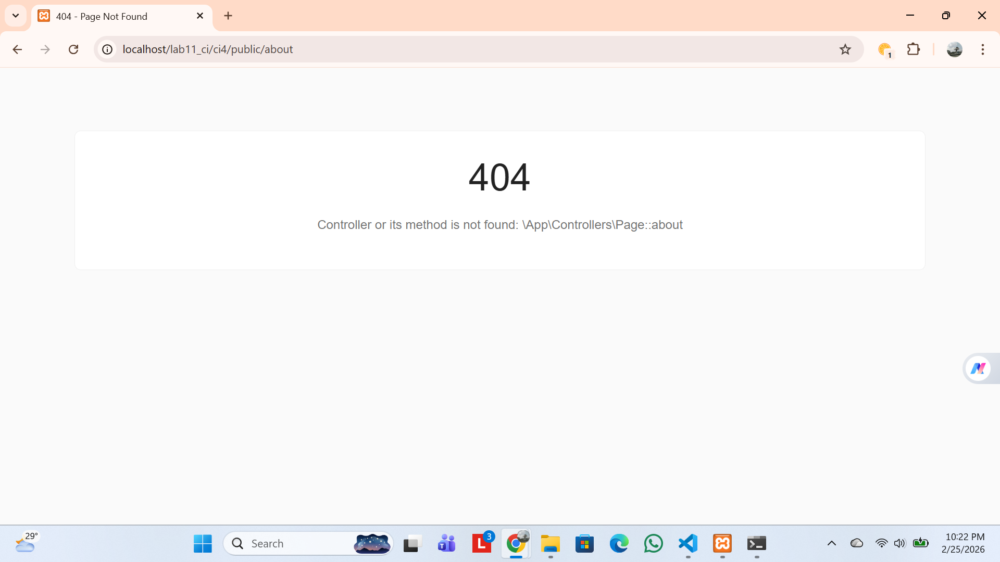.
Akan muncul tampilan error 404. untuk menanganinya dengan membuat Controller page dengan nama page.php pada direktori Controller. 
Lalu file tersebut diisi dengan kode yang telah diberikan.
##### 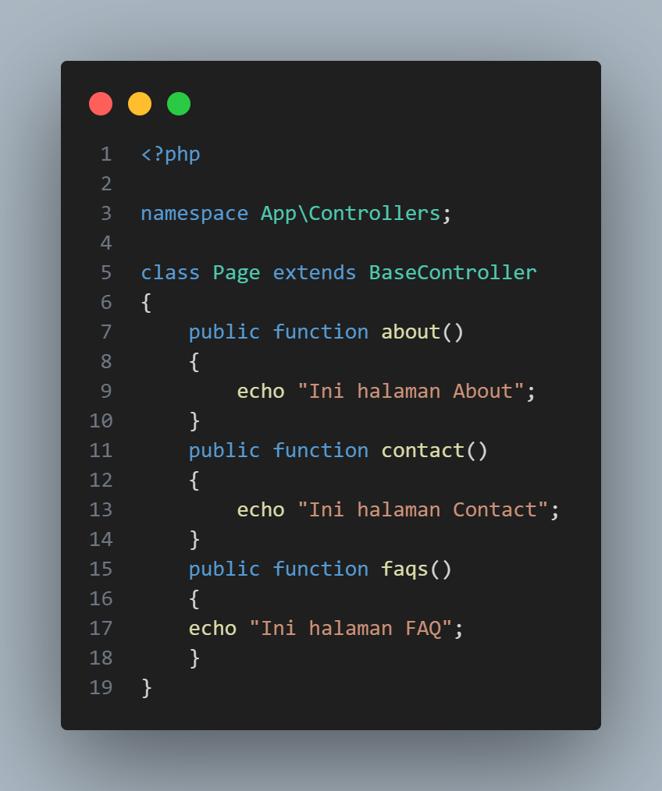.

Setelah itu kembali ke halaman yang sudah diakses tadi. maka akan muncul hasil sebagai berikut.
##### 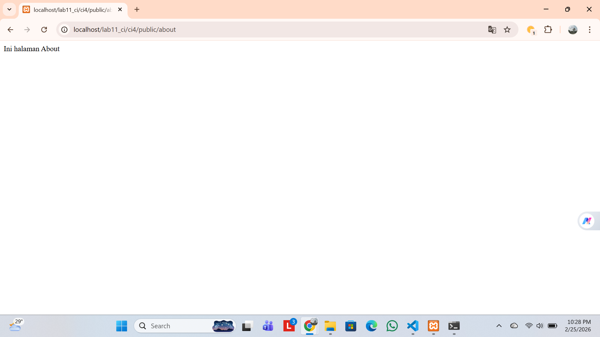.

Mengubah status autoroute dapat mengubah nilai variabelnya. Untuk menonaktifkan ubah nilai true menjadi false.
```python$routes->setAutoRoute(true);" - "$routes->setAutoRoute(false);```
lalu tambahkan method baru pada Controller Page seperti berikut.
```python
public function tos()
{
    echo "ini halaman Term of Services";
}
```

Kemudian akses halaman http://localhost/lab11_ci/ci4/tos.
##### 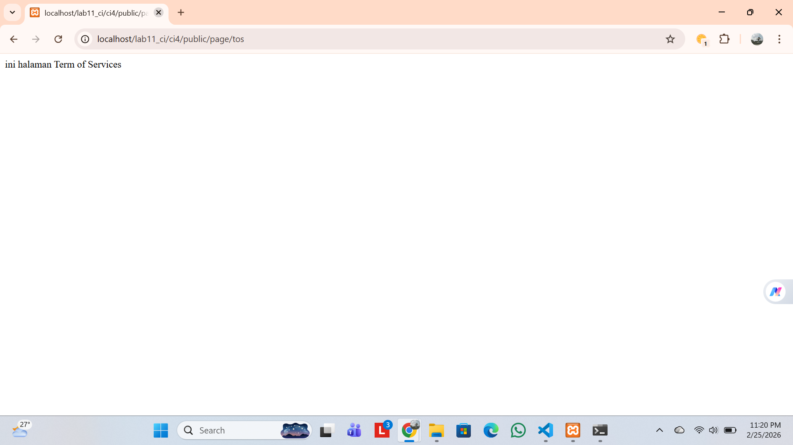.

Membuat View
Membuat file baru dengan nama about.php pada direktori view. kemudian isi kode yang telah diberikan.
```python
<!DOCTYPE html>
<html lang="en">
<head>
   <meta charset="UTF-8">
   <title><?= $title; ?></title>
</head>
<body>
   <h1><?= $title; ?></h1>
   <hr>
   <p><?= $content; ?></p>
</body>
</html>".
```

lalu mengubah method about menjadi seperti berikut:
```python
public function about()
    {
        return view('about', [
            'title'   => 'Halaman About',
            'content' => 'Ini adalah halaman about yang menjelaskan tentang isi halaman ini.'
        ]);
    }
```

kemudian refresh halaman yang tadi diakses.
##### 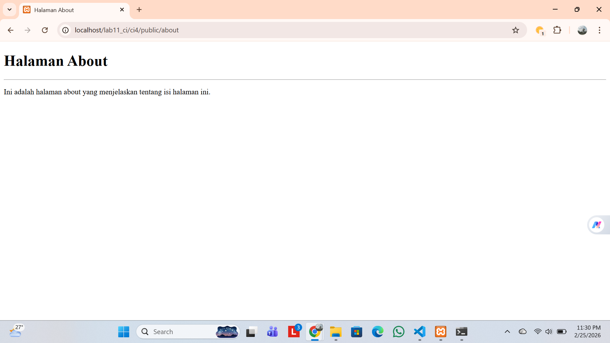.

Membuat layout CS pada direktori public dengan nama style.css.
##### .

Kemudian membuat folder template pada direktori view dan buat file header.php dan footer.php.
header.php:
##### 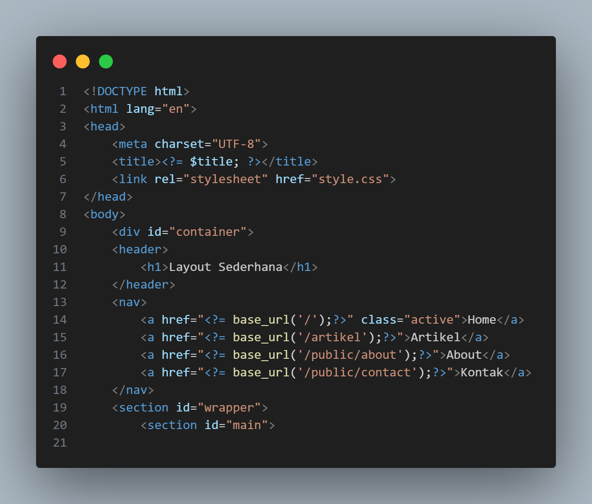.
footer.php
##### .

lalu ubah file about dengan kode seperti berikut:
##### .

lalu refresh kembali. maka hasil akan muncul seperti berikut.
##### 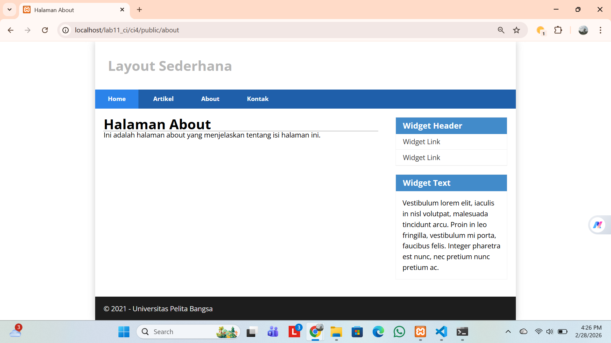.

## Pertanyaan dan Tugas
Lengkapi kode program untuk menu lainnya yang ada pada Controller Page, sehingga semua
link pada navigasi header dapat menampilkan tampilan dengan layout yang sama.
##### 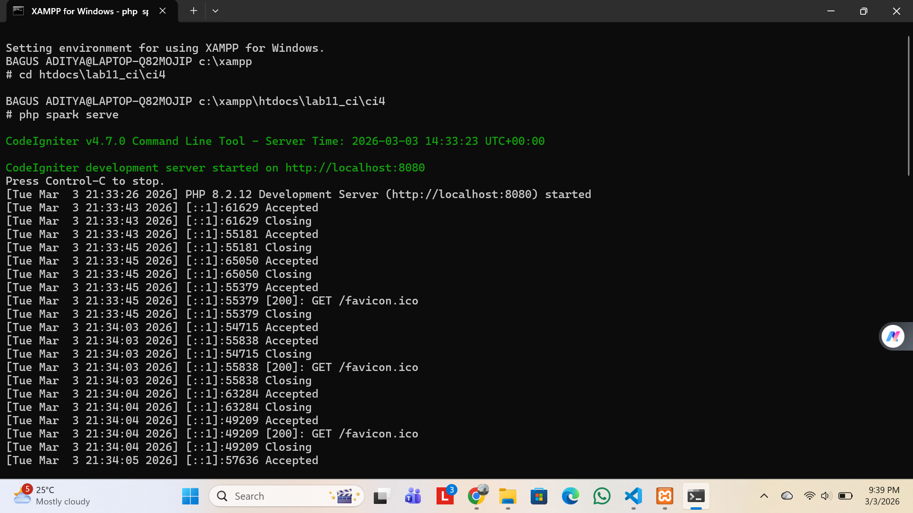.
##### 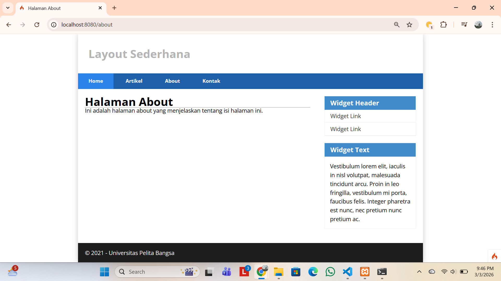.
##### .
##### 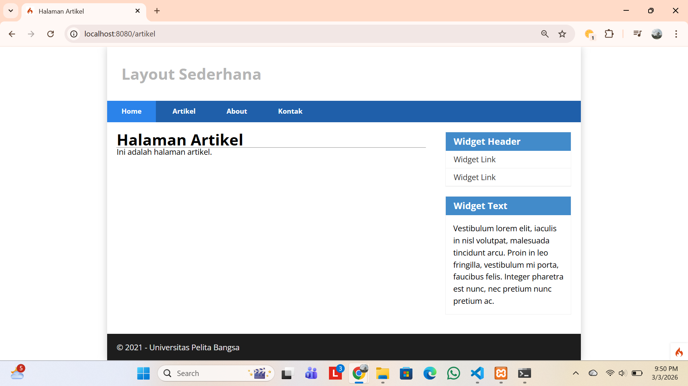.
